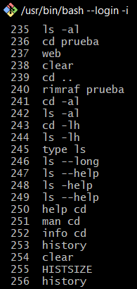
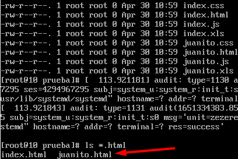
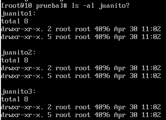
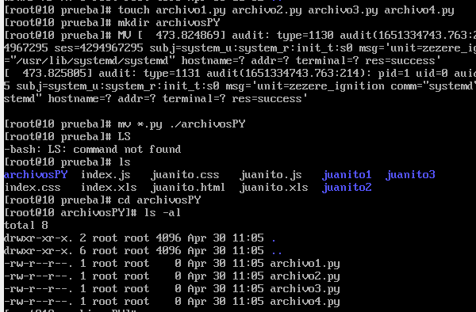
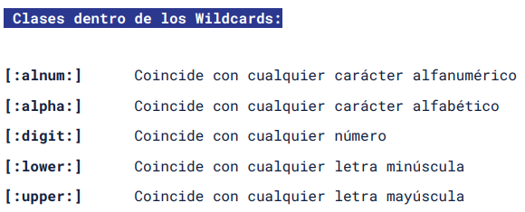
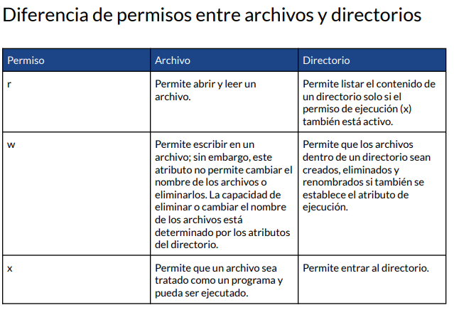
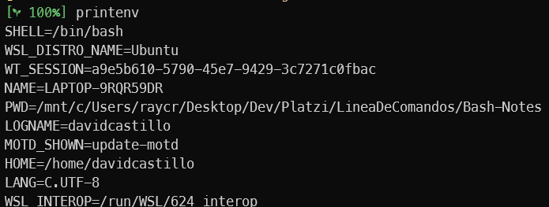
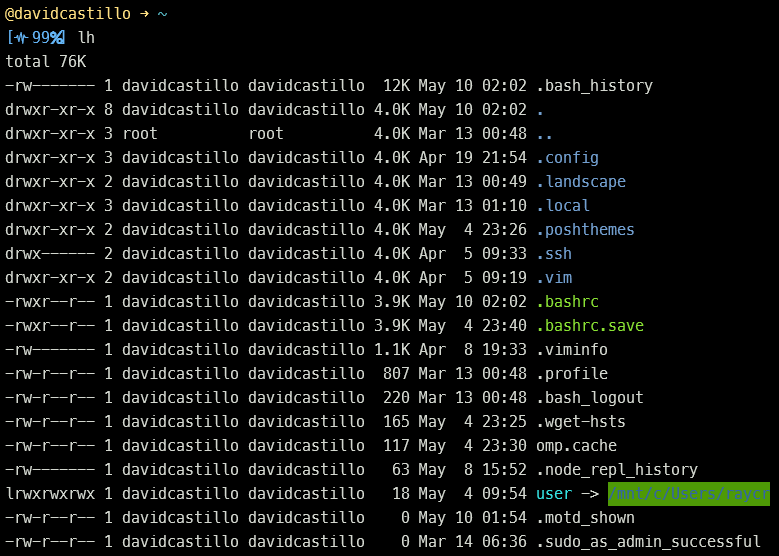

# Interprete Bash

**Terminal:** Ventana que nos muestra el `prompt` $

**Shell:** Linea de comandos. Este es un `interprete` de comandos, nos da acceso a los servicios del Sistema Operativo.

---

### Tipos de Shell

+ Bourne Shell

+ Bash Shell (Mas Comun)

+ Z shell (Mas Comun)

+ C shell

+ Fish shell

+ Power shell (Windows)


---

Un **comando** es  un programa que se puede ejecutar desde la **terminal** que puede contener algunos `parámetros` y `opciones`.

## Sistema de Archivos


Para **limpiar shell** : `Ctrl + L`

**~ :** Virgulilla

^: Circunflejo

El Shell tiene un historial de comandos, con las teclas arriba y abajo puedes navegar por los comandos ya ejecutados.

---

## Algunos comandos Basicos

`ls` : Listar archivos

`ls -lh` : Listar archivos de una manera mas entendible

`ls -a` : Listar archivos ocultos

`pwd` : Identifica la ruta donde nos encontramos

`mkdir` : Crea un Directorio

`cp` : Copiar un Archivo

`rm` : Borra un Archivo

`rmdir` : Borra un Directorio

`file {archivo}`: Identifica un archivo y lo detalla

`clear`: Limpia el Shell

## Ruta Relativa `.`

`cd .` Nos fija en el directorio actual

Un ejemplo de uso de ruta relativa `<link src="./css/main.css" />`

## Ruta absoluta `..`

`cd ..` Nos regresa al directorio padre.

Si se encuentra en una ruta padre y quieres  realizar un llamado a un js u otro, se podría con `<script src="../js/app.js" />`

## Anatomia de un CLI (Command Line Interface)

La anatomia consiste en el nombre del comando, luego la opcion (flag), y despues el argumento. Por ejemplo:

```bash
rm -rf argument
```

## Alias

La manera de acortar comandos largos, es a través de `alias`, por ejemplo:

```bash
alias web='mkdir css && cd css && touch main.css'
```

## Manipulacion de Archivos y Directorios

### Listado de elementos:

`ls -al`: Lista todos los elementos del directorio, incluido los ocultos.

`ls -ls`: Lista todos los elementos del directorio, iniciando por los mas pesados.

`ls -lr`: Lista los elementos de forma inversa

`tree`: Despliega todos los directorios como un arbol

`tree -L #`: Despliega los directorios hasta un nivel #. *flag:* `-L`: Levels

### Manipulación de elementos:

`mkdir {folder}`: Crea un nuevo directorio

`touch {file}`: Crea un nuevo archivo

Un tip para este comando es el utilizar `touch index.{html,css,js}` de esta manera creara tres archivos con nombre `index` y extensiones html, css y js.

`cp {orginal} {copia}`:  Copia un archivo

`mv {file} {path}`: Movera un archivo a la ubicación deseada.

`mv {name} {new_name}`: Cambian el nombre ya sea del archivo o del directorio

`rm {file}`: Elimina un archivo en cuestión.

`rm -i {file}:` Nuestro terminal pedirá información antes de eliminar el archivo.

`rm -r {folder}"`: Elimina el directorio indicado.

#### Flags

Los flags son los argumentos que se le agregan a los comandos, para `ls` sus flags mas comunes son:

`-l`: Long (Listado en formato largo) 

`-a`: Archivos ocultos `-S`: Size (Tamaño en bits) `-r` : Reverse (Invertir)

`-F`: El tipo de archivo ( / directorio, * ejecutable, @ enlace simbólico.)

`-h`: Tamaño en MB, KB 

`-R`: Muestra las carpetas de manera recursiva

## Directorio con Espacio

Es sugerible crear los nombres de archivos y carpetas sin espacios, peros si es necesario, para crear se suele utilizar las comillas de manera que:

```bash
mkdir "mi Carpeta"
mkdir dir1 dir2 dir3 dir4
rm -rf dir1 dir2 dir3 dir4
tree -L 2
mkdir carpeta
mv carpeta otraCarpeta
```

## Eliminar Carpetas

Si deseas eliminar carpetas usualmente se puede utilizar con el comando `rm` pero aveces nuestras carpetas contienen archivos por lo que se usa el flag `-r` de creatividad, para realizar la eliminación por fuerza se puede también utilizar `-f` de force. así tendríamos que las flags para `-rm`:Remove tendríamos.

`-r`: Recursividad `-f`:Force `-i` Informacion

## Visor de Archivos de texto plano

`head` me muestra las primeras 10 lineas de texto

Si usamos el flag `-n` podemos hacer que nos muestre un n números de lineas, por ejemplo:

```bash
head archivo.md -n 15
less archivo.md
cat archiv.md
```

`tail` este me muestra las ultimas 10 lineas de texto, y también se puede utilizar con el flag `-n`.

Otro visor de texto util es `less`, o tambien es util `cat` que nos mostrara todo el contenido del archivo de texto plano.Si te encuentras en una distribución de linux nativa, se puede utilizar el comando `xgd-open archivo.md` para abrir algún documento en cuestión, pero si te encuentras con WSL, lo sugerible es que intercambies en la misma terminal a `cmd`, y luego vuelvas a la misma con `bash`. Por ejemplo:

```bash
cmd.exe
bash
```


En WSL tambien se podria utilizar el comando `wslview arhivo.md`, algunos ejemplos serian:

```bash
wslview archivo.md
wslview carpeta
wslview . 
```

El comando `wslview` nos abrira la carpeta con la ruta relativa `.` que este caso es la carpeta actual.

En una distribución nativa se utiliza `nautilus`.

## Un comando puede ser 4 cosas

1. Un programa ejecutable

2. Un comando de utilidad de la shell

3. Una funcion de shell

4. Un alias.

Ahora, como saber si un comando es  de los 4 tipos mencionados anteriormente, bueno lo sabremos con el comando `type`, por ejemplo

```bash
type cd
#-> cd is a shell builtin
type mkdir
#-> mkdir is /usr/bun/mkdir
type ls
#-> ls is aliased to `ls --color=auto`
```

Los flags que coloquemos por ejemplo long, usualmente se colocan con dos guiones y luego un parametro, de manera que:

```bash
ls --long
```

Para pedir ayuda en los comandos podemos utilizar el flag`-help`, ejemplos:

```bash
ls --help
cd --help
mv --help
```

tambien podemos usar la utilidad de `help`, esta utilidad es exclusiva de bash shell por ejemplo:

```bash
help ls
help cd
help mv
```

Dentro de bash también podemos hacer uso de `man cd`, ojo en versión nativa. Tambien podríamos usar `info cd`, otro es `whatis cd` nos mostrara un linea muy corta de su funcionamiento.

```bash
man cd
info cd
whatis cd
```

Se puede realizar **programación en Bash Shell**.

### Working Bash History

Podemos reusar comandos ya ejecutados dentro del Bash, muchas distribuciones inclusive puede almacenar los 1000 comandos de los usuarios. Para entrar en los ultimos comandos utilizados, utilizamos el comando `history`:

```bash
history
```



Puede utilizar el comando `!254` para seleccionar el comando completo.

```bash
!254
// clear
```

### Key-Sequences para la administración del Bash

**Ctrl+C**: Usado para salir de un comando cuando este no responde.

**Ctrl+D**: Para cerrar sesión de un shell

**Ctrl+R**: Abriremos el "reversed I-search" prompt, que nos ayudara a localizar comandos previamente utilizados con una sintaxis que coloquemos.

**Ctrl+Z**: Usado para interrumpir un proceso que este ejecutando la shell.

### Alias

Se hace uso del comando `alias`, con la siguiente sintaxis:

```bash
alias l="ls -al"
```

Un punto importante a mencionar, es que estos únicamente se encontraran disponibles en el interprete actual, es decir no se podrán utilizar luego de que se cierre la ventana del shell. Esto se puede configurar en las **variables de entorno del S.O**

### WildCards

Los wildcards son comodines que nos ayuda a seccionar a un número de directorio o archivos.

```bash
ls *.html
rm -rf *.html
ls juanito?
ls -al juanito?
ls [[:upper:]]* // Mayusculas
ls [[:lower:]]* // Minuscula
ls [ad]* // Que empiecen con 'a' o 'd'
ls [a][i]* // Que empicen con 'ai'
ls [!a] // Cualquier caracteres que no coincida con 'a'
```












### Redirecciones: Funcionamiento de la SHELL

Cuando colocamos un texto con nuestro teclado en la linea de comandos, esta sera nuestro **stdin** (Standar Input) que lo describe como 0, y lsa salida de nuestro comando en la shell nos puede dar 2 salidas, un **stdout** (Standar Output) con codigo 1, y el **stderr** (Standar Error) con código 2.


Por ejemplo si realizo:

```bash
ls Documents > prueba txt
head prueba.txt
```


### + Redireccionamiento Pipe Operator

Nos permite redirigir el `stdout` (Standar Output) de un comando a un `stdin` (Standar Input) de otro comando, permitiendo generar filtros, encadenamientos y funcionales distintas. (Simbolo pipe '|' )

Listamos el directorio actual y lo observamos como si fuese un archivo de texto plano:

```bash
    ls -lh | less
    ls -lh | sort | less
```

El comando `tee` nos permite crear un archivo de texto plano. Por ejemplo `tee test.txt`, luego escribes que es lo que deseas tener en el archivo.

```bash
    ls -lh | less | tee observacion.txt
```

#### Cowsay

Para obtener una vaquita en nuestro interprete de S.O, podemos hacerlo con el comando `cowsay`. Una prueba seria:

```bash
    cowsay 'Hola'
```

Para colocarle color podriamos usar `lolcat`. Para ejecutar el comando de `cowsay` y 'lolcat' es importante que tengas instalado los paquetes correspondientes.

```bash
    cowsay 'Hola'
    cowsat -f dragon 'Hola' | lolcat
```


Utilizo un piper operator para introducir como standar input a el comando lolcat.


## OPERADORES DE CONTROL

Se pude hacer uso de los operadores `&` para ejecutar de manera asincrona, y tambienn se podria utilizar un `&&`. Tambien se puede utilizar `||` para ejecutar de manera sincronza pero que sin condicionar un `stdout` exitoso como lo hace `&&`. 

Esto vamos a utilizarlo con `webpack`.

El siguiente Script nos ayuda a crear las carpetas de `css`, `src` con los archivos de estilos `main.css`, `tablet.css` y `desktop.css`. Tambien nos creara los achivos de dinanismo de web como `app.js` en la carpeta de `src`.

```bash
mkdir src css && touch ./css/main.css ./css/tablet.css ./css/desktop.css ./src/app.js index.html && echo "Archivos Creados Correctamente" && code ./ -r && code index.html
```

## PERMISOS DE ARCHIVOS

#### Tipos de archivos:

`-`: Un archivo normal

`d`: Un directorio

`l`: Un link simbólico

`b`: Un archivo de bloque especial. Son archivos que manejan la información de los bloques de datos como USB.

#### Tipo de modo

La lectura del tipo de modo se lo realiza por tres set de datos Dueño, Grupo, Todos. Esto dependerá del usuario que estemos logeados.


`r`: read - Permiso de Lectura

`w`: write - Permiso de Escritura

`x`: execute - Permiso de Ejecución del Programa.

Como observamos, cada uno de los permisos son representados por un bit [0,1] por ende también podemos cambiar de base y utilizarlos en el sistema octal, es decir:

000: 0, 001:1,...., 111:7 -> en el ejemplo seria 755




El comando a utilizar para dar persmisos a un archivo u directorio es a traves de `chmod` (Change Mode). Tambien debemos referencias al usuario, a un grupo para todos o aplicar para todos:


#### Comando super util > text.txt

Para crear archivos de texto plano con `> texto.txt`, recuerda que `>` es un operador de redirecionamiento I/O, como no envió nada a texto.txt, entonces este se creara como un archivo de texto plano vació.

Para cambiar permisos en la Linea de Comandos:

```bash
chmod test.txt u+r // Permisos de Lectura al usuario
chmod test.txt u-w // No permito escritura al usuario
chmod test.txt u+x // No permito escritura al usuario
```

Para saber que usuario estoy logeado utilizo el comando `whoami`

```bash
sudo su // Ingresar como root
su ndcastillo // Ingresar como usuario ndcastillo
sudo rm text.txt // Cambiar de usuario a root solo en es linea de codigo
```

Para cambiar la contraseña en usuario se hace uso de la utilidad de `passwd`

```bash
passwd
\\ Cambiara la contraseña
```

Cuando cree un archivo, este se asociara al usuario que lo crea y le dará todos los permisos.

## VARIABLES DE ENTORNO

### Links Simbolicos

Es una especie de acceso directo desde el interprete del S.O (Terminal), se puede activar por `ln -s`, estos hacen referencia hacia a un lugar. Un ejemplo seria:

```bash
ln -s ~\Desktop\Dev dev
```


## Ingreso a Variables de entorno

Utilizando la utilidad `printenv` o tambien con `env`, nos listara todas las variables de entorno del sistema.



Esta variables están definidas de acuerdo a las asignación \$VAR, por ejemplo si se quiere ir al home `cd $HOME`. Para saber cuantos archivos binarios cuentas, basta con que señale un:

```bash
echo $PATH
```

<<<<<<< HEAD
A esta dirección se encontraran los interpretes de lenguaje, archivos binarios y los manejadores de paquetes como `apt`, `node`, `pip`, etc.

Se puede crear nuestras propias variables de entorno, y definir por default estas variables para no únicamente utilizar `alias`.

Para ello debemos modificar el texto plano `.bashrc`, este se encuentra en el /home/ .


En el archivo **.bashrc**

```r
lh -lahS
```

Guardamos el archivo, y reiniciamos el interprete `bash`.

```bash
lh
```



### + Agregar rutas de variables de entorno

Si decidimos crear una nueva ruta de variables de entorno que contenga los binarios que yo quisiera, primero imprimimos las direccion establecidas con:

```bash
echo $PATH
```


ahora para agregar una nueva ruta, realizamos el siguiente anexo en `.bashrc`:

```bash
PATH=$PATH:/home/davidcastillo/user/Music
```


Ahora cuando hagamos el llamado a la variable `$PATH` veremos que se agrego una nueva ruta de variables de entorno.


Las variables de entorno nos ayuda en las configuraciones de los servidores en la nube, ocultar archivos, valores, y otros.

## + COMANDOS DE BUSQUEDA

```bash
which code
# /mnt/c/Users/raycr/AppData/Local/Programs/Microsoft VS Code/bin/code
```

=======
Se puede crear nuestras propias variables de entorno, y definir por default estas variables para
